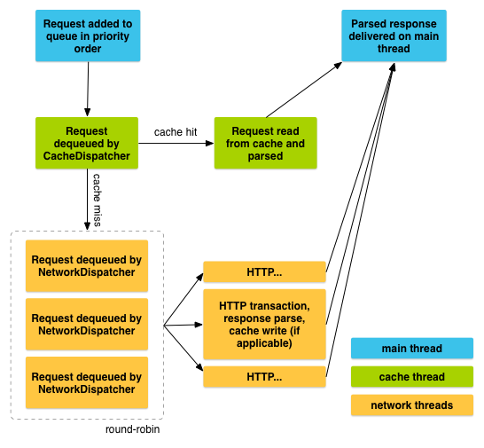

% MAD - Android 13: Volley
% Patrick Sturm
% 21.03.2018

## Information

* Any issues with this presentation? Write a ticket or send me a pull request ;).
* Repo: [https://github.com/siyb/tw-mad-13-volley](https://github.com/siyb/tw-mad-13-volley)

# Agenda

## Agenda

* Introduction
* Sending Requests
* Request Types
* Custom Request Types
* Request Queues

# Introduction

## Introduction - 1 - Basics

* Volley is a HTTP library - defacto standard on Android
* Multiple concurrent requests
* Prioritization of requests
* Caching
* Flexible and extendable

## Introduction - 2 - Resources

* Lessons:
    * [https://developer.android.com/training/volley/index.html](https://developer.android.com/training/volley/index.html)
    * [https://developer.android.com/training/volley/simple.html](https://developer.android.com/training/volley/simple.html)
    * [https://developer.android.com/training/volley/requestqueue.html](https://developer.android.com/training/volley/requestqueue.html)
    * [https://developer.android.com/training/volley/request.html](https://developer.android.com/training/volley/request.html)
    * [https://developer.android.com/training/volley/request-custom.html](https://developer.android.com/training/volley/request-custom.html)

## Introduction - 3 - Dependencies

```groovy
dependencies {
  compile 'com.android.volley:volley:1.0.0';
}
```

## Introduction - 4 - Concept

* In order to make a HTTP request, you need two things:
    * A Request object
    * A RequestQueue

## Introduction - 5 - Concept cont.



# Sending Requests

## Sending Requests - 1 - Example: Get (Json Object)

```java
RequestQueue queue = Volley.newRequestQueue(this);
queue.add(new JsonObjectRequest(
    Request.Method.GET, url, null, 
    new Response.Listener<JSONObject>() {
      @Override
      public void onResponse(JSONObject response) {
        syso(response.getString("myString");
      }
    }, 
    new Response.ErrorListener() {
      @Override
      public void onErrorResponse(VolleyError error) {
        if (error.networkResponse.statusCode == 404) {
          // error handling
        }
      }
    }));
```

## Sending Requests - 2 - Example: Post (Json Object)

```java
RequestQueue queue = Volley.newRequestQueue(this);
queue.add(new JsonObjectRequest(
    Request.Method.POST, url, myJsonObject, 
    ...
```

## Sending Requests - 3 - Example: Adjusting Priority

```java
new JsonObjectRequest(...) {
  @Override
  public Priority getPriority() {
    return Priority.HIGH
  }
};
```

## Sending Requests - 4 - Other Request Types

* ImageRequest
    * Returns images as Bitmaps
* JsonObjectRequest
    * Request for JSON objects (base: JsonRequest)
* JsonArrayRequest
    * Request for JSON arrays (base: JsonRequest)
* StringRequest
    * Request for simple strings

## Sending Requests - 5 - Example: ImageRequest

```java
queue.add(new ImageRequest(url,
  new Response.Listener<Bitmap>() {
    @Override
    public void onResponse(Bitmap bitmap) {
      image.setImageBitmap(bitmap);
    }
  }, 0, 0, ImageView.ScaleType.CENTER, null,
  new Response.ErrorListener() {
    public void onErrorResponse(VolleyError error) {
      image.setImageResource(R.drawable.image_error);
    }
  }));
```

## Sending Requests - 6 - Cancelling Requests

```java
public void sendSomeRequest() {
  ...
  myRequest.setTag(MYTAG);
}

@Override
protected void onPause() {
  super.onPause();
  queue.cancelAll(MYTAG);
}
```

# Custom Request Types

## Custom Request Types - 1 - Introduction

* If you need something more special you can implement your own request types
* All you got to do is extend Response<T> and implement the abstract methods
    * parseNetworkResponse
    * deliverResponse

## Custom Request Types - 2 - Example: gson

```java
public static final class GsonRequest<T> 
  extends Request<T> {
  private Gson gson = new Gson();
  private Class<T> clazz;
  private Response.Listener<T> listener;

  public GsonRequest(int method, 
      String url, 
      Response.Listener<T> listener, 
      Response.ErrorListener errorListener, 
      Class<T> clazz) {
    super(method, url, errorListener);
    this.clazz = clazz;
    this.listener = listener;
  }

  ...
```

## Custom Request Types - 3 - Example: gson cont.

```java
  ...
  @Override
  protected Response<T> parseNetworkResponse(
    NetworkResponse response) {
    try {
      String json = new String(
        response.data,
        HttpHeaderParser
          .parseCharset(response.headers));
      return Response.success(
        gson.fromJson(json, clazz),
        HttpHeaderParser
          .parseCacheHeaders(response));
    } catch (Throwable tr) {
      return Response.error(new ParseError(tr));
    }
  }
```

## Custom Request Types - 4 - Example: gson cont.

```java
  ...
  @Override
  protected void deliverResponse(T response) {
    listener.onResponse(response);
  }
}
```

# Request Queues

## Request Queues - 1 - Introduction

* Request queues have two important components
    * Cache (DiskBasedCache)
    * Network connection (BasicNetwork)
    
## Request Queues - 2 - Example: Manual Initialization

```java
Cache cache = new DiskBasedCache(getCacheDir(), 1024 * 1024);
// apparently, the developer did not have the best oppinion about
// HttpURLConnection :D
Network network = new BasicNetwork(new HurlStack());
RequestQueue queue ? new RequestQueue(cache, network);

queue.add(request);
```

## Request Queues - 3 - Change Implementations

* Network
    * Interface: Network - override performRequest(Request<?> request) 
    * Interface: HttpStack - override performRequest(Request<?> request, Map<String, String> additionalHeaders)
* Cache
    * Interface: Cache - override multiple methods

# Any Questions?
